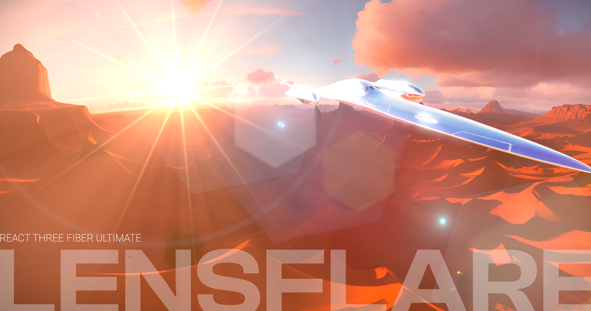

# ULTIMATE LENS FLARE FOR REACT THREE FIBER

#### by Anderson Mancini

[](https://twitter.com/Andersonmancini)

Ultimate Lens flare adds the optical aberration caused by the dispersion of light entering the lens through its edges.

[](https://ultimate-lens-flare.vercel.app)

[Click here to see an example](https://ultimate-lens-flare.vercel.app)

This captivating phenomenon creates a stunning optical effect that adds a touch of enchantment to your r3f projects, especially for sun lights. Ultimate Lens Flare creates mesmerizing circular or hexagonal bursts of light. Embrace the magic and elevate your projects with this unique and alluring effect. This captivating optical innovation introduces a new dimension to your content, amplifying its visual impact and captivating your audience.

Unlock a world of possibilities with Ultimate Lens Flare's intuitive interface. Seamlessly adjust parameters such as brightness, star points, glare size, ghosts, burst and much more, while real-time previews allow you to see the impact of your adjustments instantly. Embrace your creativity and effortlessly bring your artistic vision to life.

## More demos on CodeSandbox

- [Ultimate Lens Flare with class text](https://codesandbox.io/s/anderson-mancini-lens-flare-glass-text-example-9elqmx)

- [Ultimate Lens Flare simple example ](https://codesandbox.io/s/anderson-mancini-lens-flare-simple-example-ox6611)

- [Ultimate Lens Flare multiple materials example ](https://codesandbox.io/s/anderson-mancini-lens-lensflare-materials-example-4gjc16)
- [Ultimate Lens Flare StarWars Ship example ](https://codesandbox.io/s/anderson-mancini-lens-lensflare-starwars-example-qmpuj1)

### Customization options

Here you can watch a video of customization options. You can fully customize it
[](https://www.youtube.com/watch?v=a4W4SUZ5uu8)

# HOW TO USE?

### 1. Download the files component and save it on your project

[Download the Ultimate Lens Flare source code](https://gist.github.com/ektogamat/9b02bf248cab901b1175524b00742964) and save into your project

[Download the util source code](https://gist.github.com/ektogamat/18b84f5ad652091fe5a89555a5d30000) and <strong>save into your project in the same folder</strong> as the Ultimate Lens Flare is.

### 2. Import the component

```
import LensFlare from './UltimateLensFlare'
// Remember to adjust the path to match your project's structure
```

### 3. Provide an image for the lens dirt as a prop and add this to your EffectComposer

You need to <strong>provide an image to act like a lens dirt filter</strong>. Idealy it should be an image with 16:9 aspect ratio. This image needs to be small, since it will be processed by the shader. I'm giving an example in the public folder, but feel free to replace by any other image you want. Just remember to pass the file name as a "dirtTextureFile" prop like shown bellow.

```
<EffectComposer>
    <LensFlare dirtTextureFile={'/lensDirtTexture.png'} />
</EffectComposer>
```

\*\*This is a mandatory parameter and it expects a path to find the file on your project. Don't need to load a texture using useTexture.

###And you are done ✨

---

# Changing the Blend Mode

`Ultimate Lens Flare` was created to be easy and simple to use. It uses a custom shader pass on Effect composer to read the scene and overlay it with your lens flare effect automatically.

However, you might want to tweak some things to match your needs. The main parameter you can change to affect the overal look of the effect is the `blendFunction`. By default, this will be set to <strong>BlendFunction.NORMAL</strong>, but you can change it by passing a different blending mode using the `blendFunction` prop:

```js
<EffectComposer>
  <LensFlare dirtTextureFile={'/lensDirtTexture.png'} blendFunction={BlendFunction.PIN_LIGHT} />
</EffectComposer>
```

You can get pretty different and beautiful results using other Blend functions such as `BlendFunction.PIN_LIGHT`, `BlendFunction.OVERLAY`, `BlendFunction.PIN_MULTIPLY`, etc. Remember to import [using `import { BlendFunction } from 'postprocessing'` ] the BlendModes from post processing to use them.

# Using LEVA to adjust the parameters

For convenience, you can adjust a bunch of parameters inside the Ultimate Lens Flare. Just import `folder` and `useControls` from leva and then copy and paste these props to have an interface to play with the values. Once you are happy with the results, you can manually copy back all the values from the Leva controls to this `useControls` default value and save and you are done!

```
import { folder, useControls } from 'leva'
```

```
  const lensFlareProps = useControls({
    LensFlare: folder(
      {
        enabled: { value: true, label: 'enabled?' },
        opacity: { value: 1.0, min: 0.0, max: 1.0, label: 'opacity' },
        position: {value: { x: -25, y: 6, z: -60 }, step: 1, label: 'position'},
        glareSize: { value: 0.35, min: 0.01, max: 1.0, label: 'glareSize'},
        starPoints: { value: 6.0, step: 1.0, min: 0, max: 32.0, label: 'starPoints'},
        animated: { value: true, label: 'animated?'},
        followMouse: { value: false, label: 'followMouse?'},
        anamorphic: { value: false, label: 'anamorphic?'},
        colorGain: { value: new Color(56, 22, 11), label: 'colorGain'},

        Flare: folder({
          flareSpeed: { value: 0.4, step: 0.001, min: 0.0, max: 1.0, label: 'flareSpeed'},
          flareShape: { value: 0.1, step: 0.001, min: 0.0, max: 1.0, label: 'flareShape'},
          flareSize: { value: 0.005, step: 0.001, min: 0.0, max: 0.01, label: 'flareSize'}
        }),

        SecondaryGhosts: folder({
          secondaryGhosts: { value: true, label: 'secondaryGhosts?'},
          ghostScale: { value: 0.1, min: 0.01, max: 1.0, label: 'ghostScale'},
          aditionalStreaks: { value: true, label: 'aditionalStreaks?'}
        }),

        StartBurst: folder({
          starBurst: { value: true, label: 'starBurst?'},
          haloScale: { value: 0.5, step: 0.01, min: 0.3, max: 1.0}
        })
      },
      { collapsed: true}
    )
  })
```

# Ignoring occlusion on some objects

If, for some reason, you need to disable the occlusion effect, for Eg: to fake a skybox like I'm doing in some of my demos, you can add `userData={{ lensflare: 'no-occlusion' }}` to any object/mesh. This will tell to Ultimate Lens Flare's internal raycaster to ignore that specific object/mesh.

# Improving performance with BHV

This effect uses Raycaster to detect the occlusion. It is important to use `<bvh><Scene></bvh>` to get a faster response and a better performance when using it.

If you face any performance issues, you can get some performance back by controling the `dpr` and disabling the `multisampliing` on the `EffectComposer` if you can.

# Follow the mouse cursor or Fake Sun Vector Position

You can enable the `followMouse` to use this effect as a 2D effect, ignoring completelly the occlusion. If set to true, it will ignore the vector position to fake the sun light.

```
<LensFlare followMouse={true} dirtTextureFile={'/lensDirtTexture.png'} />
```

You can also use a position `{x: NUMBER, y: NUMBER, z: NUMBER}` to pass a position in the 3D world so the effect can read that position and project it into the effect. In order for this to work, `followMouse` needs to be set to `false`

```
<LensFlare position={{x: 10, y: -5, z: 60}} dirtTextureFile={'/lensDirtTexture.png'} />
```

# Compatibility

`Ultimate Lens Flare` is compatible with all modern browsers that support WebGL 2.0 (WebGL 1 is not supported), using three.js version r152 or later is recommended.

# Limitations

The Ultimate Lens Flare uses the raycaster to check for material type and determine if it is MeshTransmissionMaterial or MeshPhysicalMaterial and check for the transmission parameter. This means that, to act like a glass, your materials needs to have `transmission = 1` or `transparent = true + opacity = 0.X`. The effect will read the opacity value to determine its brightness automatically.

The internal raycaster is set to read just the firstHit of the raycaster, meaning that if the first detected object is not transparent nor transmissive, it will occlude the effect.

# Getting Started using this demo project

Download and install Node.js on your computer (https://nodejs.org/en/download/).

Then, open VSCODE, drag the project folder to it. Open VSCODE terminal and install dependencies (you need to do this only in the first time)

```
npm install
```

Run this command in your terminal to open a local server at localhost:8080

```
npm start
```

<hr/>

# License

A CC0 license is used for this project. You can do whatever you want with it, no attribution is required. However, if you do use it, I'd love to hear about it!

# Can you leave a star please?

Would be really appreciated if you are willing to give me a star here on GitHub 🎉 or buy me a coffee ☕ https://www.buymeacoffee.com/andersonmancini. The money will be used to produce more content about threejs or to buy new courses.

# Credits

Hard to remember everything I read to achieve this, but here's a list of resources that have been helpful to me:

- https://www.shadertoy.com/view/4sK3W3
- https://www.shadertoy.com/view/4sX3Rs
- https://www.shadertoy.com/view/dllSRX
- https://www.shadertoy.com/view/Xlc3D2
- https://www.shadertoy.com/view/XtKfRV
- https://blog.maximeheckel.com/posts/the-study-of-shaders-with-react-three-fiber/
- https://blog.maximeheckel.com/posts/beautiful-and-mind-bending-effects-with-webgl-render-targets/
- https://docs.pmnd.rs/react-postprocessing/effects/custom-effects
- https://threejs.org/docs/index.html#manual/en/introduction/How-to-use-post-processing
- https://threejs.org/docs/index.html#manual/en/introduction/Matrix-transformations
- https://github.com/mrdoob/three.js/blob/master/examples/jsm/objects/Lensflare.js
- https://chat.openai.com/chat
- https://skybox.blockadelabs.com/

### Special thanks

Here is some of the many friends that helped me to achieve this effect:

- https://twitter.com/0xca0a
- https://github.com/abernier
- https://twitter.com/N8Programs
- https://twitter.com/MaximeHeckel
- https://twitter.com/spidersharma
- https://twitter.com/vis_prime
- https://twitter.com/Cody_J_Bennett
- https://twitter.com/0beqz
- https://twitter.com/maya_ndljk
- https://twitter.com/bruno_simon
- https://twitter.com/CantBeFaraz
- https://twitter.com/th_ebenezer
